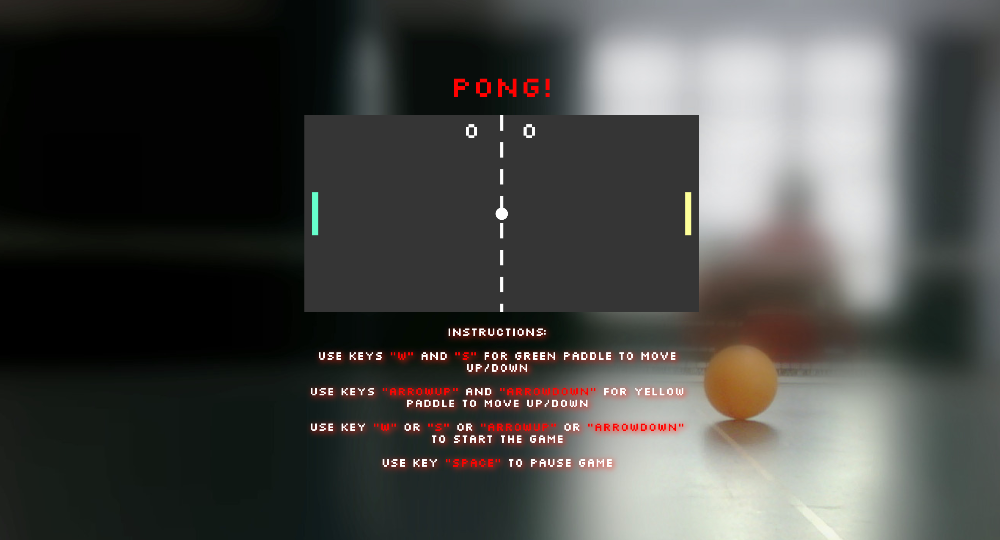

# Pong Game 

## When you play the PONG Game, you either win or lose. There's no middle ground. :)

### Game Preview


 # Technologies Used

* HTML
* SVGs
* CSS (animation)
* JavaScript
* OOP with ES2015
* nodeJS
* Git & Github

## Keys
 
 #### Player 1 (GREEN Paddle)
  
  * w : Up
  * s : Down

#### Player 2 (YELLOW Paddle)

  * ▲ : Up
  * ▼: Down

#### Pause
  
  Spacebar : To Pause

#### To start the game 

  PRESS( w or s or ▲ or ▼ )


## Setup

Ensure you have [Node.js](https://nodejs.org/en/) installed first.

**Install dependencies:**

`$ npm install`

**Run locally with the Parcel dev server:**

`$ npm start`

Once you run the start command you can access your project at http://localhost:3000.

Read more about the [Parcel web application bundler here](https://parceljs.org/).


## Deploy

The deployment workflow for this project will be a bit different from what you've used when deploying simple static websites.

To deploy your finished Pong project as a GitHub page, you must first **update the `predeploy` script in the `package.json` file with the name of your repo.**

For example, if your repo URL is:

https://github.com/bob/pong-project

Update the `predeploy` script as follows:

```json
"predeploy": "rm -rf dist && parcel build index.html --public-url /pong-project",
```

Once you have done this, you can run:

`$ npm run deploy`

Now check out your deployed site 🙂
